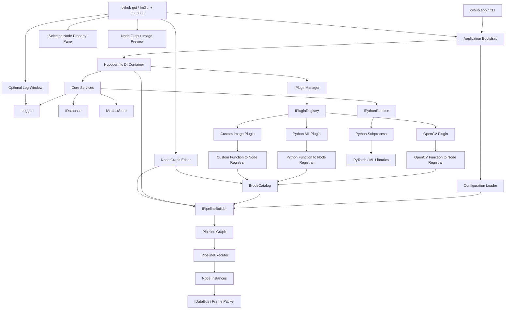
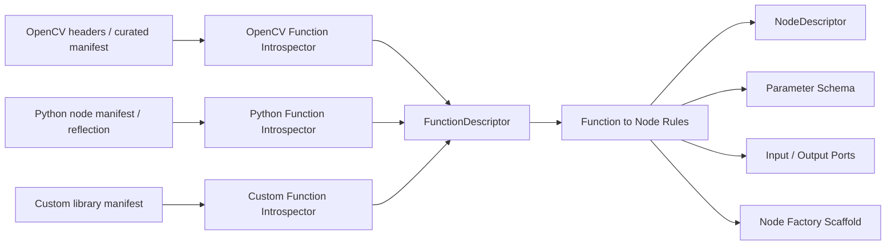
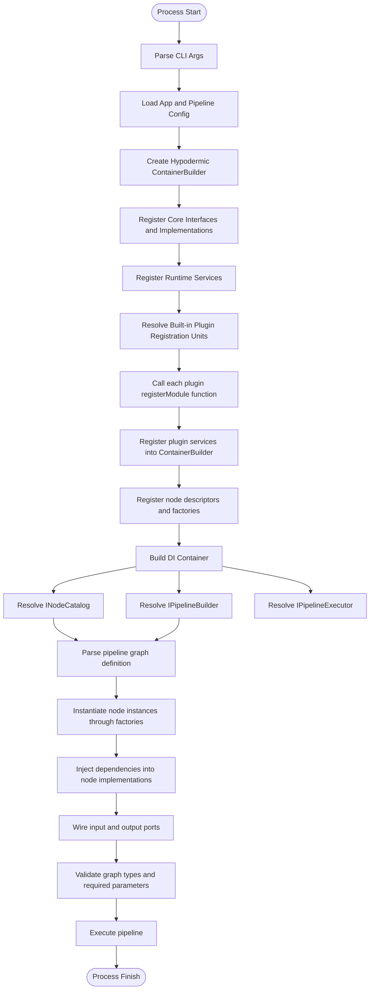
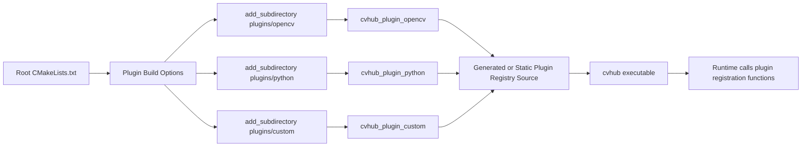
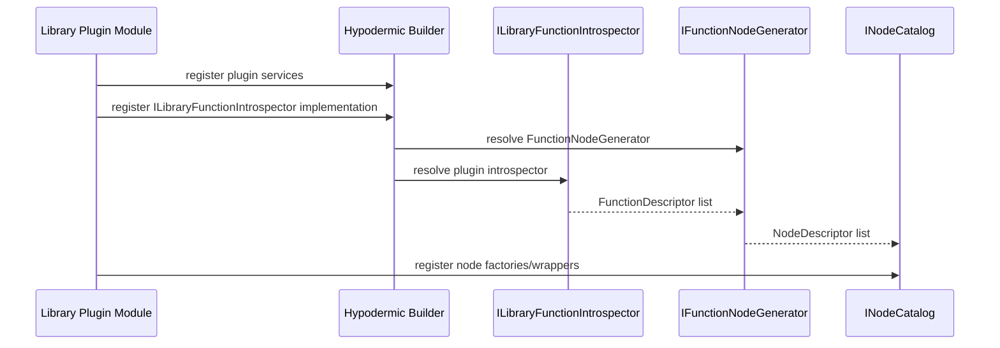
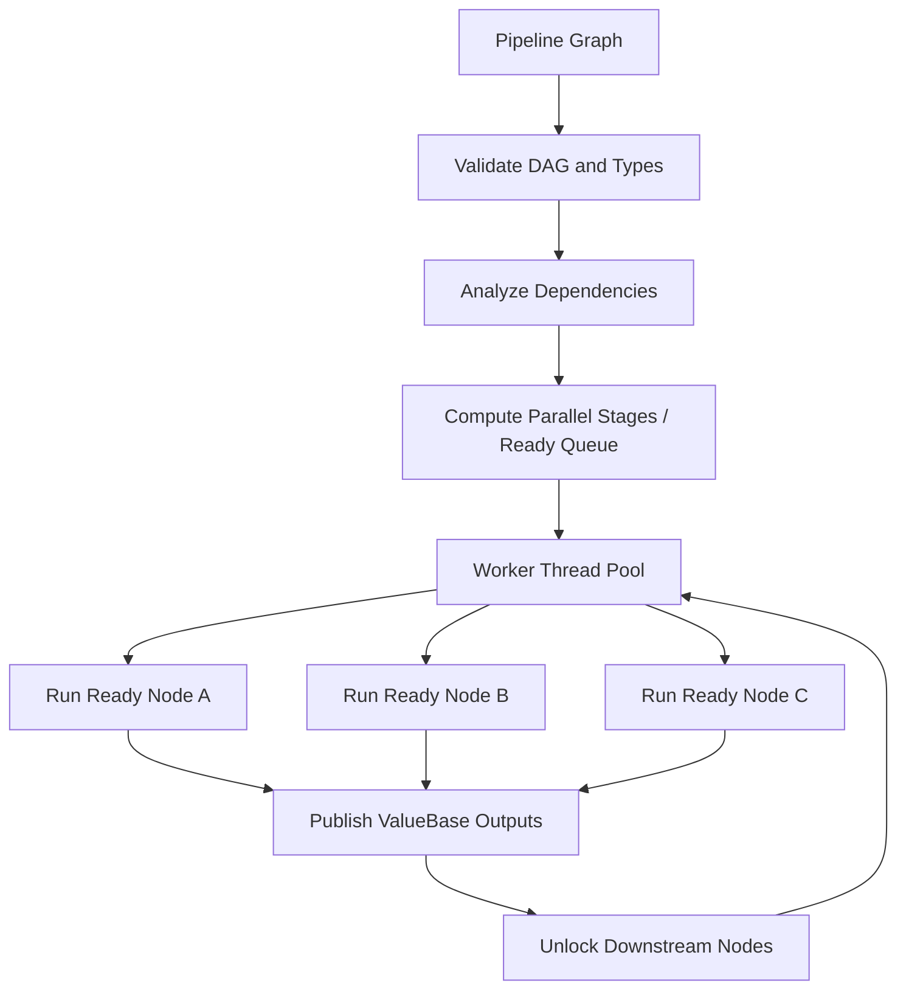
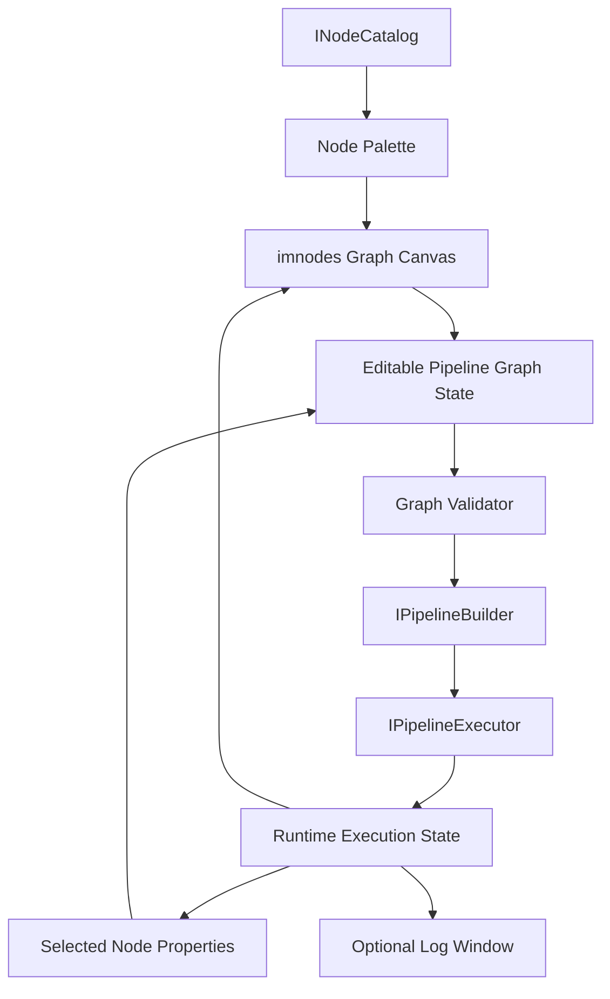
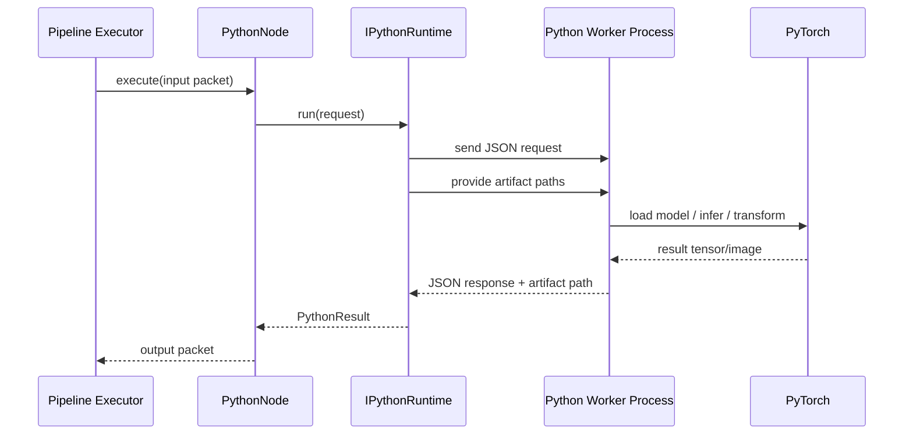

# CV_HUB Architecture

## 目的

CV_HUB は、OpenCV などの画像処理ライブラリや PyTorch などの ML 系ライブラリを、共通のノードグラフとして扱う画像処理パイプライン基盤です。

基本方針は以下です。

- 画像処理ライブラリの 1 関数を 1 ノードとして扱う
- ライブラリごとの関数登録はプラグインとして分離する
- パイプライン内部はノードアーキテクチャで統一する
- 基盤サービス、ノード生成、プラグイン登録、実行器を interface と implementation に分ける
- DI コンテナには Hypodermic を用いる
- Python / PyTorch などの ML 系処理は Python サブプロセス経由で扱う
- UI は Dear ImGui と imnodes で実装し、ノードグラフ編集、プレビュー、プロパティ編集、ログ表示を行う
- ビルドは CMake で行い、各プラグイン階層に `CMakeLists.txt` を置く
- CMake に巻き込まれたプラグインだけがビルド対象になり、ランタイムの DI コンテナ構築時にノードとして実体化できる

## アーキテクチャ概要



## レイヤ構成

### Application Layer

CLI、設定読み込み、DI コンテナ構築、パイプライン実行開始を担当します。

主な責務:

- コマンドライン引数の解釈
- 設定ファイルの読み込み
- CMake で組み込まれたプラグイン登録関数の呼び出し
- Hypodermic コンテナの build
- パイプライン定義から実行グラフを生成
- 実行結果とエラーコードの返却

### Core Layer

ライブラリに依存しない基盤の interface を置きます。

主な責務:

- ノード、ポート、型、パケット、パイプライングラフの抽象化
- ログ、DB、ストレージ、メトリクスなどの基盤サービス interface
- DI 登録用の module / installer interface
- プラグインロードとノードカタログ登録の interface
- Python サブプロセス実行の抽象化

### Runtime Layer

Core の interface を実装し、実際の実行制御を担当します。

主な責務:

- ノードインスタンス生成
- ノード間のデータ受け渡し
- 同期/非同期実行制御
- エラー、キャンセル、リトライの扱い
- Python サブプロセスの起動、通信、終了管理

### Plugin Layer

OpenCV、Python ML、独自画像処理など、外部ライブラリごとの登録処理を担当します。

主な責務:

- ライブラリ関数をノード定義へ変換する
- ノードファクトリを登録する
- 必要な依存サービスを DI コンテナへ登録する
- プラグイン固有の型変換、パラメータスキーマ、検証を提供する

### Function Introspection Layer

ライブラリ側の関数定義からノード定義を生成するための中間層です。

完全にライブラリ非依存で関数を自動解析するのは現実的ではありません。C++、C API、Python、テンプレート関数、overload、optional parameter、出力引数の扱いがライブラリごとに違うためです。

そのため、以下の 2 段構えにします。

1. ライブラリプラグインごとの introspector / adapter 実装クラスが関数定義を読み、共通の `FunctionDescriptor` に変換する
2. 基盤側の `FunctionNodeGenerator` 実装クラスが `FunctionDescriptor` から `NodeDescriptor` と node factory scaffold を生成する



この層では、関数解析だけを plugin ごとの責務にします。生成ルールと出力形式は基盤側に集約します。

### Presentation Layer

Dear ImGui と imnodes を使って、ノードグラフ編集 UI を提供します。

主な責務:

- `INodeCatalog` から利用可能ノードを一覧化する
- imnodes 上でノード、スロット、リンクを描画する
- 選択中ノードのプロパティを左側固定ウィンドウで編集する
- ノード内に出力画像プレビュー、パラメータ一覧、入力/出力スロットを描画する
- メニューバーからログ、メトリクス、DBビューなどの補助ウィンドウを表示/非表示にする
- UI 操作をパイプライン定義へ反映する

Presentation Layer は runtime の具象実行ロジックを直接持たず、`INodeCatalog`、`IPipelineBuilder`、`IPipelineExecutor`、`ILogger` などの interface に依存します。

## インスタンス化フロー



## ビルド時プラグイン登録フロー



### 方針

CMake に含めたプラグインだけを実行バイナリへリンクします。ランタイムでは OS の動的プラグイン探索を前提にせず、まずは静的リンクされた registration unit を呼び出す構成にします。

この方式の利点:

- クロスプラットフォームで扱いやすい
- ビルドに含めた機能が明確になる
- DI コンテナ構築時に全ノードを確定できる
- 未リンクの外部ライブラリ関数がランタイムで突然必要になる事故を避けやすい

将来的に必要であれば、共有ライブラリの runtime discovery を `IPluginLoader` の別実装として追加します。

## ノードモデル

### NodeDescriptor

ノードのメタデータです。UI、設定ファイル検証、パイプライン構築で使います。

含める情報:

- `id`: 安定したノードID。例: `opencv.resize`
- `displayName`: 表示名。例: `OpenCV Resize`
- `library`: 所属ライブラリ。例: `opencv`
- `functionName`: 関数名。例: `resize`
- `category`: 分類。例: `geometry`
- `kind`: ノード種別。例: `Source`, `Transform`, `Sink`, `Utility`
- `inputs`: 入力ポート定義
- `outputs`: 出力ポート定義
- `parameters`: パラメータスキーマ
- `ui`: ノード表示に関する補助メタデータ
- `factoryKey`: DI / factory で実体化するためのキー

### ノード種別

入力限定ノード、出力限定ノード、通常の変換ノードは `inputs` と `outputs` から機械的に判定できます。

基本判定:

- `inputs.empty() && !outputs.empty()`: Source node。画像ファイル入力、カメラ入力、テスト画像生成など。
- `!inputs.empty() && outputs.empty()`: Sink node。画像ファイル出力、DB保存、外部送信など。
- `!inputs.empty() && !outputs.empty()`: Transform node。OpenCV の画像変換、推論、フィルタなど。
- `inputs.empty() && outputs.empty()`: Utility / Command node。設定、状態操作など。初期設計では原則避ける。

ただし、関数シグネチャだけに完全依存しない方針にします。理由は以下です。

- OpenCV には出力引数を `cv::OutputArray` として受け取る関数があり、C++ の引数上は入力に見えることがある
- `imread` / `imwrite` のように画像処理関数というより IO 操作に近いものがある
- Python ML node は worker 側の仕様から入力/出力を定義するため、C++ 関数シグネチャだけでは判定できない
- UI 表示では、同じ関数でも「プレビューを出すか」「保存だけするか」などの扱いを変えたい場合がある

そのため、プラグインの function-to-node 変換クラスはシグネチャから初期推論を行い、最終的な `inputs`、`outputs`、`kind` は `NodeDescriptor` に明示します。UI と runtime は推論結果ではなく `NodeDescriptor` を信頼します。

## Function to Node 生成

### 方針

ライブラリ関数からノードを作る処理は、全ライブラリで共通の中間モデルを通します。

```text
Library-specific definition
    -> LibraryFunctionIntrospector
    -> FunctionDescriptor
    -> FunctionNodeGenerator
    -> NodeDescriptor + INodeFactory + optional generated source
```

ライブラリごとの差分は `LibraryFunctionIntrospector` に閉じ込めます。ノード化の共通ルール、UI 用メタデータ、parameter schema、port schema の生成は `FunctionNodeGenerator` に集約します。

### 責務分担

基盤側:

- `IFunctionNodeGenerator` interface
- `FunctionNodeGenerator` implementation
- `FunctionDescriptor` / `FunctionArgumentDescriptor` / `FunctionReturnDescriptor`
- `NodeDescriptor` 生成ルール
- `PortDescriptor` 生成ルール
- `ParameterSchema` 生成ルール
- node kind 推論
- manifest override 適用の共通処理
- 生成エラーと診断情報の共通表現

ライブラリプラグイン側:

- `ILibraryFunctionIntrospector` の実装クラスを 1 つ定義する
- 対象ライブラリの関数一覧を収集する
- 関数シグネチャ、manifest、型ヒント、docstring などを読んで `FunctionDescriptor` を返す
- ライブラリ固有型を共通 semantic type に変換する
- 公開対象にしない関数を除外する
- overload や template の扱いを決める

原則として、1 ライブラリプラグインにつき 1 つの introspector 実装を持ちます。例外として、OpenCV の module ごとに分けた方が管理しやすい場合は、plugin 内で複数 introspector を持ち、plugin module がそれらを集約します。

巨大なライブラリプラグインでは、基盤の `LibraryFunctionIntrospectorBase` を継承した facade を 1 つ公開し、その内部でプラグイン専用 interface と複数 resolver / policy 実装へ分割します。

例:

```text
Foundation
├── ILibraryFunctionIntrospector
└── LibraryFunctionIntrospectorBase

OpenCV Plugin
├── OpenCVFunctionIntrospector : LibraryFunctionIntrospectorBase
├── IOpenCVRawFunctionProvider
├── IOpenCVFunctionResolver
├── IOpenCVTypeResolver
├── IOpenCVEnumResolver
├── IOpenCVFlagResolver
├── IOpenCVOverloadPolicy
├── IOpenCVParameterPolicy
├── OpenCVOverrideRepository
└── resolvers/
    ├── core/
    ├── imgproc/
    ├── imgcodecs/
    ├── video/
    ├── features2d/
    └── calib3d/
```

外部から見える plugin の入口は `OpenCVFunctionIntrospector` だけにします。OpenCV の `InputArray`、`OutputArray`、enum、flags、overload、module ごとの関数定義差分は plugin 内部の resolver / policy が吸収します。

この方針により、基盤側は個別ライブラリの事情を知らずに済み、プラグイン側は巨大な関数群を module や関数 family ごとに分割して保守できます。

### Interface 案

```cpp
class ILibraryFunctionIntrospector {
public:
    virtual ~ILibraryFunctionIntrospector() = default;
    virtual std::string_view libraryId() const = 0;
    virtual std::vector<FunctionDescriptor> inspect() = 0;
};

class IFunctionNodeGenerator {
public:
    virtual ~IFunctionNodeGenerator() = default;
    virtual std::vector<NodeDescriptor> generate(
        std::span<const FunctionDescriptor> functions,
        const FunctionNodeGenerationOptions& options) = 0;
};
```

登録時の流れ:



実装上は、DI コンテナ build 前に introspector を直接 new する必要が出る場合があります。その場合でも interface は同じにし、bootstrap が `FunctionNodeGenerationService` に introspector のリストを渡す形にします。

### プラグイン内部 resolver 構成

OpenCV のように全画像処理関数を対象にする場合、関数定義のばらつきは避けられません。基盤の基底クラスは処理順序と診断、override merge の共通処理だけを持ち、ライブラリ固有の意味解決はプラグイン内部 interface に委譲します。

推奨する責務:

- `IRawFunctionProvider`: header 解析、manifest、生成済みメタデータなどから raw function を集める
- `IFunctionResolver`: raw function を `FunctionDescriptor` に変換する関数 family 単位の resolver
- `ITypeResolver`: ライブラリ固有型を `SemanticType` や `ValueTypeDescriptor` に変換する
- `IEnumResolver`: enum domain と enum value を解決する
- `IFlagResolver`: bit flags、単一選択 enum、modifier flags を区別する
- `IOverloadPolicy`: overload の公開/非公開、node ID の付け方を決める
- `IParameterPolicy`: parameter 名、範囲、UI 表示、required/optional を補正する
- `IOverrideRepository`: manifest override を読み込む

基底クラスの役割:

- raw function の取得順序を決める
- resolver chain を呼ぶ
- diagnostics を集約する
- manifest override を共通形式で merge する
- `FunctionDescriptor` の最低限の整合性を検証する

派生プラグイン側の役割:

- resolver / policy を組み合わせる
- module ごとの例外を吸収する
- ライブラリ固有型、enum、flags、overload の意味を閉じ込める
- 公開しない関数を除外する

継承階層は深くしすぎず、基盤 base -> plugin facade -> plugin internal resolver の 3 段程度に抑えます。細かい差分は継承より composition で resolver / policy を差し替える方針にします。

### FunctionDescriptor

`FunctionDescriptor` はライブラリ関数をノード生成用に正規化した中間表現です。

想定フィールド:

```cpp
struct FunctionDescriptor {
    std::string library;
    std::string namespaceName;
    std::string functionName;
    std::string qualifiedName;
    std::vector<FunctionArgumentDescriptor> arguments;
    std::vector<FunctionReturnDescriptor> returns;
    std::vector<std::string> tags;
    std::optional<std::string> documentation;
    FunctionBindingKind bindingKind;
};
```

`FunctionArgumentDescriptor` は、以下のような情報を持ちます。

- 引数名
- 型名
- default value
- 入力/出力/入出力の direction
- 画像、数値、enum、文字列、ファイルパス、model path などの semantic type
- optional か required か
- UI editor type

### 共通生成ルール

`FunctionNodeGenerator` は `FunctionDescriptor` を見て以下を生成します。

- `NodeDescriptor.id`
- `NodeDescriptor.library`
- `NodeDescriptor.functionName`
- `NodeDescriptor.kind`
- input port descriptors
- output port descriptors
- parameter schema
- UI summary metadata
- factory key
- 必要に応じて node wrapper の scaffold

### 自動判定できるもの

比較的自動化しやすいもの:

- 関数名
- ライブラリ名
- namespace
- 通常の scalar parameter
- enum parameter
- default value
- input image port
- output image port
- source / transform / sink の初期推論

### 自動判定しにくいもの

人間または plugin 固有ルールで補うべきもの:

- `cv::InputArray` / `cv::OutputArray` / `cv::InputOutputArray` の正確な意味付け
- overload のどれをノードとして公開するか
- C++ template function の具体化
- 画像以外の行列、特徴量、輪郭、点群などの semantic type
- UI で主要パラメータとして見せる項目
- パラメータの妥当範囲
- 複数出力をどうポート化するか
- inplace 処理を別ノードにするかどうか
- Python 関数の型ヒントが不足している場合のポート定義

### Manifest override

自動推論結果は manifest で上書きできるようにします。

例:

```yaml
functions:
  - qualifiedName: cv::resize
    nodeId: opencv.resize
    kind: Transform
    title: "OpenCV: resize()"
    inputs:
      - name: image
        type: image
    outputs:
      - name: image
        type: image
    parameters:
      - name: width
        type: int
        min: 1
      - name: height
        type: int
        min: 1
      - name: interpolation
        type: enum
        values: [nearest, linear, cubic, area]
```

この manifest は「自動生成を諦めるための手書き定義」ではなく、「自動推論に足りない意味情報を補うための override」として扱います。

### OpenCV の現実的な進め方

OpenCV は C++ header だけから完全なノード定義を安定生成するより、初期は curated manifest + 共通生成器で始めるのが現実的です。

初期実装:

1. 対象関数を manifest に列挙する
2. `InputArray` / `OutputArray` / scalar / enum の mapping rule を作る
3. `FunctionDescriptor` を生成する
4. `FunctionNodeGenerator` で `NodeDescriptor` を生成する
5. 実行 wrapper は関数ごとに薄い adapter を持つ

その後、Clang tooling などで header 解析を追加し、manifest の手書き量を減らします。

### Python ML の現実的な進め方

Python 側は型ヒント、docstring、manifest を組み合わせます。

初期実装:

- Python worker node を manifest で定義する
- 入出力 artifact と parameter schema を明示する
- Python 関数の signature / type hints は検証補助として使う

将来:

- `inspect.signature()` で関数シグネチャを取得する
- Pydantic などで parameter schema を定義する
- manifest override で UI 表示や artifact 型を補う

## データモデルとノードグラフ実行

### ValueBase

ノードの入出力データは基盤側の `ValueBase` を根にした型で扱います。ノード同士は `ValueBase` のスマートポインタを受け渡し、余分なデータコピーを避けます。

想定 interface:

```cpp
class ValueBase {
public:
    virtual ~ValueBase() = default;
    virtual ValueType type() const = 0;
    virtual std::string_view typeName() const = 0;
    virtual bool immutable() const = 0;
};
```

画像は `ImageValue` として扱います。

```cpp
class ImageValue final : public ValueBase {
public:
    std::span<const std::byte> bytes() const;
    std::span<std::byte> mutableBytes();

    int width() const;
    int height() const;
    int channels() const;
    int strideBytes() const;
    PixelFormat pixelFormat() const;
    ValueType type() const override;
};
```

初期実装では、画像は `std::vector<std::byte>` または `std::shared_ptr<Buffer>` を内部に持ちます。`char` 配列相当の連続 buffer に、width、height、channels、stride、pixel format を付与します。

### ポインタ接続と所有権

ノードの出力と次ノードの入力は、値本体をコピーせず `std::shared_ptr<const ValueBase>` を渡します。

基本方針:

- 入力は `std::shared_ptr<const ValueBase>` として受け取る
- 出力は `std::shared_ptr<ValueBase>` または `std::shared_ptr<const ValueBase>` として返す
- Transform node は原則として新しい出力 value を作る
- inplace 可能な処理は descriptor に `supportsInPlace` を持たせ、runtime が安全な場合だけ許可する
- 複数 downstream が同じ value を読む場合は immutable value として共有する
- mutable access が必要な場合は copy-on-write か exclusive ownership を要求する

想定実行 API:

```cpp
using ValuePtr = std::shared_ptr<const ValueBase>;
using MutableValuePtr = std::shared_ptr<ValueBase>;

struct NodeExecutionContext {
    std::unordered_map<PortId, ValuePtr> inputs;
    std::unordered_map<PortId, MutableValuePtr> outputs;
};
```

この設計により、ノード間の通常接続は pointer transfer で済みます。画像 buffer の再利用、pooling、GPU memory などは `ValueBase` 派生型や `IBufferAllocator` の実装差し替えで扱います。

### 型安全性

`ValueBase` は runtime の共通口ですが、ノード内部では必要に応じて型を確認して派生型へ downcast します。

```cpp
const auto image = value_cast<ImageValue>(context.inputs.at(inputImagePort));
```

型不一致は graph validation で事前に検出します。runtime execution 時にも防御的に検査し、構造化エラーを返します。

`PortDescriptor` は以下を持ちます。

- port id
- display name
- direction
- required / optional
- accepted value type
- accepted semantic type
- multiplicity

### グラフ解析

パイプラインは DAG を基本とします。初期実装では cycle を禁止します。feedback loop や streaming pipeline は後続拡張に回します。

graph validation で行うこと:

- 存在しない node / port への edge を検出する
- port direction の不一致を検出する
- value type / semantic type の不一致を検出する
- required input が未接続の node を検出する
- cycle を検出する
- topological order を生成する
- 並列実行可能な stage を計算する

### 並列実行

ノードグラフを解析して、依存関係のないノードを並列実行します。

基本アルゴリズム:

1. graph validation で DAG を確認する
2. 各ノードの入次数を計算する
3. 入次数 0 のノードを ready queue に入れる
4. worker thread pool が ready node を実行する
5. 実行完了した node の downstream の入次数を減らす
6. 入次数が 0 になった node を ready queue に入れる
7. 全ノード完了またはエラー/cancel まで繰り返す



スレッド数:

- デフォルトは `std::thread::hardware_concurrency()` を上限にする
- pipeline config で最大スレッド数を指定できる
- ノードごとに `threadSafe`, `exclusiveResourceKey`, `estimatedCost` を descriptor に持てるようにする
- Python subprocess node や GPU node は専用 resource key で同時実行数を制限できるようにする

### 実行状態

runtime は UI とログへ以下の状態を公開します。

- node queued
- node running
- node completed
- node failed
- node skipped
- elapsed time
- output preview value
- diagnostics

UI はこの runtime state を参照して、imnodes 上のノード色、実行中表示、出力プレビューを更新します。

### コピー削減の注意点

ポインタ接続だけでは安全性は保証できません。以下をルール化します。

- downstream が複数ある出力は immutable として共有する
- mutable operation は single consumer の場合だけ許可する
- runtime は `supportsInPlace` と reference count だけでなく、graph 上の consumer 数で安全性を判定する
- plugin node は入力 value を勝手に書き換えない
- buffer lifetime は `shared_ptr` と allocator が管理する
- UI preview は実行中 buffer を直接 mutate しない

## UI アーキテクチャ

### 採用ライブラリ

- Dear ImGui: Docking、メニューバー、プロパティパネル、ログウィンドウ、各種 editor widget
- imnodes: ノードグラフ、ピン、リンク、ノード選択
- backend: GLFW + OpenGL など、まずはクロスプラットフォームで扱いやすい構成を想定する

UI backend は抽象化しておき、将来的に SDL、Vulkan、Metal などへ差し替えられるようにします。

### 画面構成

```text
+--------------------------------------------------------------------------------+
| Menu Bar                                                                       |
| File  Edit  View  Pipeline  Plugins  Window  Help                              |
+--------------------------+-----------------------------------------------------+
| Selected Node Properties | Node Graph Editor                                   |
|                          |                                                     |
| - Node ID                |  [imnodes canvas]                                   |
| - Library                |                                                     |
| - Function               |  +-----------------------------+                    |
| - Parameters             |  | OpenCV: resize()            |                    |
| - Validation errors      |  | +-------------------------+ |                    |
|                          |  | | output image preview    | |                    |
|                          |  | +-------------------------+ |                    |
|                          |  | width: 640                  |                    |
|                          |  | height: 480                 |                    |
|                          |  | in image  o        o image  |                    |
|                          |  +-----------------------------+                    |
+--------------------------+-----------------------------------------------------+
| Optional windows: Log, Metrics, Node Catalog, Plugin Inspector, Artifact Viewer |
+--------------------------------------------------------------------------------+
```

左側の Selected Node Properties は固定表示にします。ノード内には要約だけを置き、詳細編集は左ペインに寄せます。これにより、imnodes のキャンバス上でノードが肥大化しすぎる問題を避けます。

### imnodes ノード表示

各ノードの中身は以下を標準レイアウトにします。

```text
+----------------------------------+
| <Library>: <function>()          |
| +------------------------------+ |
| | output image preview         | |
| +------------------------------+ |
| parameters:                     |
|   width: 640                    |
|   height: 480                   |
|                                  |
| input slots              outputs |
| o image                  image o |
+----------------------------------+
```

表示ルール:

- タイトルは `library:functionName()` を基本にする。例: `OpenCV: resize()`
- 出力画像があるノードはサムネイルを表示する
- Sink node のように出力画像がない場合はプレビュー領域を省略する
- Source node は入力スロットを表示しない
- Sink node は出力スロットを表示しない
- パラメータ一覧は主要値だけを表示し、全項目編集は左プロパティペインで行う
- ノード内のスロット表示は `PortDescriptor` の型と方向に従う

### プロパティペイン

左側固定ウィンドウには現在選択中のノードを表示します。

表示内容:

- ノードID
- ライブラリ名
- 関数名
- ノード種別
- 入力/出力ポート一覧
- パラメータエディタ
- 型検証エラー
- 実行状態
- 直近の実行時間
- 直近のエラー

複数ノード選択時は、共通操作だけを表示します。未選択時は、パイプライン全体のプロパティを表示します。

### メニューバーと補助ウィンドウ

ログ、メトリクス、DB、artifact viewer などは常時表示せず、メニューバーの `Window` メニューから表示/非表示を切り替えます。

想定メニュー:

- `File`: New, Open, Save, Save As
- `Edit`: Undo, Redo, Delete
- `Pipeline`: Validate, Run, Stop
- `Plugins`: Plugin list, Reload metadata
- `Window`: Log, Metrics, Node Catalog, Plugin Inspector, Artifact Viewer
- `Help`: About

ログウィンドウは `ILogger` の sink として UI 側へログイベントを渡し、ユーザーが `Window > Log` を有効にしたときだけ表示します。

### UI と Runtime の同期



UI は編集中の graph state と実行中の runtime state を分けて扱います。編集中の変更を即座に実行中パイプラインへ反映するかは、初期実装では手動 `Validate` / `Run` にします。

### UI ファイル構造

推奨構造:

```text
src/
├── ui/
│   ├── CMakeLists.txt
│   ├── ImGuiApp.cpp
│   ├── ImGuiApp.hpp
│   ├── NodeGraphEditor.cpp
│   ├── NodeGraphEditor.hpp
│   ├── NodeRenderer.cpp
│   ├── NodeRenderer.hpp
│   ├── PropertyPanel.cpp
│   ├── PropertyPanel.hpp
│   ├── LogWindow.cpp
│   ├── LogWindow.hpp
│   ├── MenuBar.cpp
│   └── MenuBar.hpp
```

`NodeRenderer` は `NodeDescriptor` と runtime preview state を受け取り、imnodes の描画だけを担当します。ノード生成、実行、DI 解決をここに持ち込みません。

### INode

実行時ノードの interface です。

想定する責務:

- 入力パケットを受け取る
- パラメータを検証する
- 処理を実行する
- 出力パケットを返す
- 実行ログ、メトリクス、エラーを runtime に返す

### INodeFactory

`NodeDescriptor` とパイプライン設定をもとに、実行時の `INode` インスタンスを生成します。

外部ライブラリ固有のオブジェクト、ログ、DB、Python runtime などの依存は Hypodermic から注入します。

## プラグインモデル

### IPluginModule

各プラグインは、DI 登録とノード登録を行う module として扱います。

想定 interface:

```cpp
class IPluginModule {
public:
    virtual ~IPluginModule() = default;
    virtual std::string_view id() const = 0;
    virtual void registerServices(Hypodermic::ContainerBuilder& builder) = 0;
    virtual void registerNodes(INodeCatalog& catalog) = 0;
};
```

### OpenCV Plugin

OpenCV 関数を C++ ノードとして登録します。

例:

- `cv::resize` -> `opencv.resize`
- `cv::cvtColor` -> `opencv.cvt_color`
- `cv::GaussianBlur` -> `opencv.gaussian_blur`
- `cv::threshold` -> `opencv.threshold`

OpenCV の型を Core の型へ閉じ込めるため、変換は plugin 内に置きます。

### Python ML Plugin

PyTorch など Python 側の ML ライブラリを Python サブプロセス経由で実行します。

想定構成:

- C++ 側: `PythonSubprocessRuntime`
- C++ 側: `PythonNode`
- Python 側: worker script
- 通信: JSON-RPC 風メッセージ + ファイル/共有メモリによる大きなテンソル受け渡し

初期実装では安定性を優先し、画像やテンソルは一時ファイル経由で渡します。性能が問題になった段階で shared memory や Arrow IPC を検討します。



## DI 方針

Hypodermic では interface を中心に登録します。

登録方針:

- Core service は application bootstrap で登録する
- Runtime service は runtime module で登録する
- Plugin service は各 plugin module で登録する
- Node instance は factory 経由で生成する
- NodeDescriptor は `INodeCatalog` に集約する

例:

```cpp
builder.registerType<SpdlogLogger>().as<ILogger>().singleInstance();
builder.registerType<SqliteDatabase>().as<IDatabase>().singleInstance();
builder.registerType<NodeCatalog>().as<INodeCatalog>().singleInstance();
builder.registerType<PipelineBuilder>().as<IPipelineBuilder>();
builder.registerType<PipelineExecutor>().as<IPipelineExecutor>();
```

## 推奨ファイル構造

```text
CV_HUB/
├── CMakeLists.txt
├── README.md
├── AGENTS.md
├── cmake/
│   ├── CVHubCompilerOptions.cmake
│   ├── CVHubDependencies.cmake
│   └── CVHubPluginRegistry.cmake
├── config/
│   └── pipeline.yaml
├── docs/
│   ├── ARCHITECTURE.md
│   └── REPOSITORY_RULES.md
├── apps/
│   └── cvhub/
│       ├── CMakeLists.txt
│       └── main.cpp
├── include/
│   └── cvhub/
│       ├── core/
│       │   ├── ValueBase.hpp
│       │   ├── ImageValue.hpp
│       │   ├── ValueType.hpp
│       │   ├── INode.hpp
│       │   ├── INodeCatalog.hpp
│       │   ├── INodeFactory.hpp
│       │   ├── IPluginModule.hpp
│       │   ├── ILibraryFunctionIntrospector.hpp
│       │   ├── IFunctionNodeGenerator.hpp
│       │   ├── IPipelineBuilder.hpp
│       │   ├── IPipelineExecutor.hpp
│       │   ├── ILogger.hpp
│       │   ├── IDatabase.hpp
│       │   ├── IArtifactStore.hpp
│       │   └── IPythonRuntime.hpp
│       └── runtime/
│           ├── PipelineGraph.hpp
│           ├── GraphExecutionPlan.hpp
│           ├── NodeDescriptor.hpp
│           ├── PortDescriptor.hpp
│           ├── FunctionDescriptor.hpp
│           ├── ParameterSchema.hpp
│           └── ExecutionState.hpp
├── src/
│   ├── core/
│   │   └── CMakeLists.txt
│   ├── runtime/
│   │   ├── CMakeLists.txt
│   │   ├── NodeCatalog.cpp
│   │   ├── FunctionNodeGenerator.cpp
│   │   ├── PipelineBuilder.cpp
│   │   ├── PipelineExecutor.cpp
│   │   ├── GraphAnalyzer.cpp
│   │   ├── ThreadPool.cpp
│   │   └── PythonSubprocessRuntime.cpp
│   ├── ui/
│   │   ├── CMakeLists.txt
│   │   ├── ImGuiApp.cpp
│   │   ├── NodeGraphEditor.cpp
│   │   ├── NodeRenderer.cpp
│   │   ├── PropertyPanel.cpp
│   │   └── LogWindow.cpp
│   └── services/
│       ├── CMakeLists.txt
│       ├── logging/
│       ├── database/
│       └── artifact_store/
├── plugins/
│   ├── CMakeLists.txt
│   ├── opencv/
│   │   ├── CMakeLists.txt
│   │   ├── include/
│   │   │   └── cvhub/plugins/opencv/
│   │   └── src/
│   │       ├── OpenCVPluginModule.cpp
│   │       ├── OpenCVNodeFactory.cpp
│   │       ├── OpenCVFunctionIntrospector.cpp
│   │       ├── OpenCVTypeResolver.cpp
│   │       ├── OpenCVEnumResolver.cpp
│   │       ├── OpenCVFlagResolver.cpp
│   │       ├── OpenCVOverloadPolicy.cpp
│   │       ├── ResizeNode.cpp
│   │       ├── CvtColorNode.cpp
│   │       └── GaussianBlurNode.cpp
│   ├── python/
│   │   ├── CMakeLists.txt
│   │   ├── src/
│   │   │   ├── PythonPluginModule.cpp
│   │   │   └── PythonNode.cpp
│   │   └── worker/
│   │       ├── cvhub_worker.py
│   │       └── nodes/
│   │           └── torch_inference.py
│   └── custom/
│       ├── CMakeLists.txt
│       └── src/
├── tests/
│   ├── CMakeLists.txt
│   ├── unit/
│   └── integration/
└── .codex/
    └── skills/
        └── cv-hub-dev/
            ├── SKILL.md
            ├── agents/
            │   └── openai.yaml
            └── references/
                └── architecture.md
```

## 実装順序

1. Core interface を定義する
2. Runtime の最小実装を作る
3. Hypodermic の DI bootstrap を作る
4. 静的リンク前提の plugin registration を作る
5. OpenCV plugin で `resize` など少数ノードを実装する
6. YAML などのパイプライン設定からノードグラフを生成する
7. Python subprocess runtime を追加する
8. PyTorch inference node を plugin として追加する
9. テスト、ログ、DB、artifact store を実運用寄りに固める

## 設計ルール

- public header には interface と軽量な value object を置く
- 実装詳細は `src/` または plugin の `src/` に閉じる
- 外部ライブラリ型を Core interface に漏らさない
- plugin は Core に依存してよいが、Core は plugin に依存しない
- runtime は plugin の具象型を直接知らない
- Python worker の失敗は C++ 側で構造化エラーとして扱う
- ノード ID は一度公開したら互換性を意識して変更する
- CMake option で plugin の有効/無効を切り替えられるようにする

## CMake 方針

ルート:

```cmake
cmake_minimum_required(VERSION 3.24)
project(CV_HUB LANGUAGES CXX)

option(CVHUB_BUILD_PLUGIN_OPENCV "Build OpenCV plugin" ON)
option(CVHUB_BUILD_PLUGIN_PYTHON "Build Python ML plugin" ON)

add_subdirectory(src)
add_subdirectory(plugins)
add_subdirectory(apps/cvhub)
```

プラグイン集約:

```cmake
if(CVHUB_BUILD_PLUGIN_OPENCV)
    add_subdirectory(opencv)
endif()

if(CVHUB_BUILD_PLUGIN_PYTHON)
    add_subdirectory(python)
endif()
```

各プラグイン:

```cmake
add_library(cvhub_plugin_opencv STATIC)
target_sources(cvhub_plugin_opencv PRIVATE
    src/OpenCVPluginModule.cpp
    src/ResizeNode.cpp
)
target_link_libraries(cvhub_plugin_opencv
    PUBLIC cvhub_core
    PRIVATE opencv_core opencv_imgproc
)
```

## パイプライン設定例

```yaml
nodes:
  - id: input
    type: core.image_file_input
    params:
      path: samples/input.png

  - id: resize
    type: opencv.resize
    params:
      width: 640
      height: 480
      interpolation: linear

  - id: infer
    type: python.torch_inference
    params:
      model: models/classifier.pt
      device: cpu

  - id: output
    type: core.image_file_output
    params:
      path: output/result.png

edges:
  - from: input.image
    to: resize.image
  - from: resize.image
    to: infer.image
  - from: infer.overlay
    to: output.image
```

## 未決定事項

- パイプライン設定形式を YAML に固定するか、JSON も同時対応するか
- ノード間の大容量データ転送を最初から shared memory にするか
- Python worker のプロトコルを独自 JSON-RPC にするか、既存 RPC を採用するか
- Plugin を最初から shared library として runtime discovery できるようにするか
- DB を初期は SQLite にするか、interface のみ先に置くか
